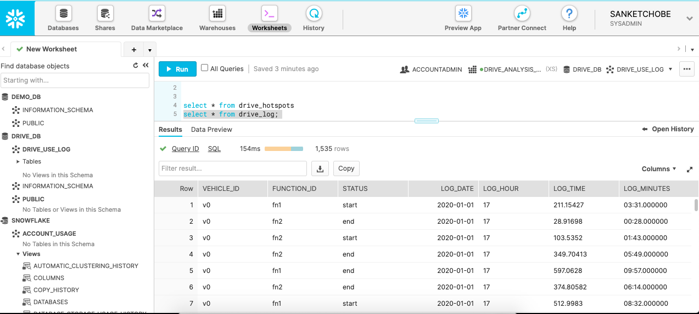
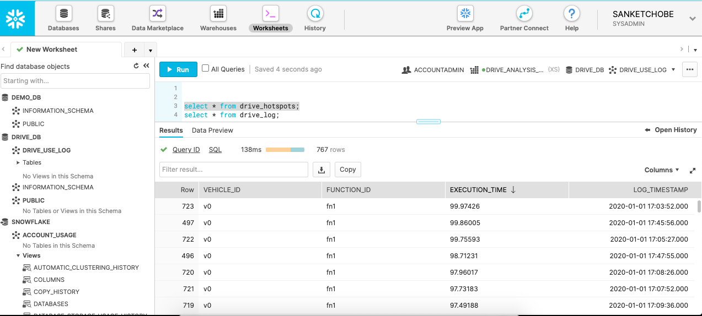

# Drive Log ETL

An ETL pipeline for loading the Drive logs for analytics.. 

Important components.
- Star/ Snowflake Schema for Data model 
- Spark with Python
- AWS (for scalable pipeline)
- Snowflake (Datawarehouse)

**Assumptions**

*Assumptions on Source Data and Format*
- I am assuming the input data is available in multiple source formats including CSV, Parquet and S3 files and databases like MySql etc. I am using only CSV file for this ETL pipeline.
- Since the logs are offloaded daily, we can assume that the input log data file can have 3 different parts. Date, Hour and the input file name. For this ETL pipeline, I will keep 3 different parts for a source file, Date, Hour and file name. 
- Each file name represents the log offloaded at a particular date at particular time. For example, Date: 2020-01-01, Hour:17, Filename: 2020-01-01_17.csv represnts the log offloaded on 2020-01-01 at 17 hours. 
- This helps in maintaining the daily log data at particular hours in particular format. We can perform ETL on the data to load data in datawarehouse for daily logs, all logs and derrive particular insights like hotspots on daily as well as all time data.

*Assumptions on Target Data and Format*
- We are assuming the data is needed by Data Scientists and Analysts in the format of reports like daily, monthly or yearly Drive Logs and Drive Hotspots. 
- These reports can be used to perform analysis and visualize a particular function that takes large amount of time to complete in the particular time period, and understand the pattern of execution of different functions for different type of vehicles. 
- Considering the above requirements for analysis, I am making a star schema for the data model. The data model should give correct snapshot of the historical logs, daily logs and aggregated facts like hotspots. 
- I am assuming the source data is reported as a daily or hourly file stored in multiple formats, it is important to design an ETL framework which will extract data from multiple sources and formats and load in a datawarehouse which supports this variety of information. 
 
*Design Assumptions*
1. Scalability 
    - I am assuming that the ETL pipeline should be highly scalable. Since the logs are offloaded on daily basis and the amount of logs can be in TBs, we should make sure the ETL pipeline can handle the large amount of data on daily basis and should be able to perform ETL and load operations for huge amount of data. 
    - I am going to use Spark framework to process the large amount of data on regular basis. For the initial implementation, I am implementing the pipeline using the Spark framework to run the ETL pipeline and load in Snowflake datawarehouse. 
    - Spark supports the scalability for the TBs of data and Snowflake datawarehouse also supports the scalability for large amount of data in multiple formats. 
2. Consistency
    - Snowflake datawarehouse supports consistency for the data as it supports multiple formats including structured and semi-structured type of data.
    - The data models in the Snowflake datawarehouse are based on the relational DB models hence it supports concurrency as well as consistency for large amount of data.
    - for ETL framework Spark in association with AWS services like AWS EMR or AWS EC2 can support consistency for huge amount of data being processed in Spark by adding the nodes and cluster to process this data. 
3. Persistence
    - Snowflake datawarehouse supports the persistence for large amount of data. Since the Snowflake has compute and storage as separate services, and Snowflake supports multiple clusters for each of these functions, the data persistence for such large data is supported by Snowflake. 
    - Spark with AWS services like EMR and EC2 supports persistence for large amount of data. Since AWS provides multi-region support, it supports the persistence of ETL functionality.  
4. Availability 
    - Snowflake datawarehouse supports the high availability of data since the data storage and computations are separate, and Snowflake supports multi-cluster and multi-region functionality. 
    - Spark with AWS provides high availability for the ETL pipeline since it can handle TBs of data with data backup using multi-region functionality. 
     
5. Optimization and Cost
    - Though AWS with Spark supports different opportunities for optimization, it may be costly to debug and resolve the errors in the Spark or AWS environments.
    - For this ETL pipeline considering the requirements of analytics on large amount of data, I am not thinking of cost effective solution. It makes sense to consider the ETL pipeline supporting variety of data source formats, process this data and load in a consistent, scalable datawarehouse solution. 
    
6. Historical Data
    - Snowflake supports the storage of data as historical information. It supports the storage as a cloud service and in different formats. 
    - The data storage for historical data can be retrived later for the analyzing the historical data and building out the functions, models for data analysis. 

I am explaining my ETL pipeline using the following components and architecture. The PySpark code has 3 steps and explained in the following steps.

*Pre-requisites*

1. Install and configure Spark. 
2. Install and configure Snowflake - free/enterprise set up.
3. Install and configure Spark-Snowflake connectivity. 

Additional Pre-requisites:
1. Set up and configure AWS EMR and AWS s3 to set up ETL pipeline on AWS. 

**Star Schema for Datawarehouse**

*Data Model*
- Vehicle: This table is a dimensional table containing the attributes for Vehicle like Vehicle name or Vehicle type.
- Function: This table is a dimensional table containing the attributes for Function, like function name, function type, etc. 
- Status: This table is a dimensional table containing the attributes for Status, like status (Start, End), status type, etc. 
- Log_Time: This table is a dimensional table containing the time related attributes like year, date, month, day, hour, minutes, and timestamp.
- Driver_Log: This table is a fact table containing the keys from each of the dimensional table like vehicle_id, function_id etc. This table represents the core data for drive logs for all time.
- Drive_Log_Daily: This table is a derived table or view which represents the drive log on daily basis. 
- Drive_Hotspots: This table represents aggregated fact or view showing the drive hotspots for any function. We can derive the daily hotspots,monthly hotspots, etc. which can be further used by Data Scientists to perform analysis or visualize data. 

*ETL Pipeline*
- Extract Data: This step extracts the data from multiple sources like CSV, parquet or json. This step will also extract the information for date and hour for which we are going to load the log.
- Transform Data: This step will convert the extracted data and convert in the required format, like converting the time in seconds to minutes and creating the timestamp from date, hour and minutes. I used the PySpark and SparkSQL code to create the load ready dataframes for each of the table Drive_log, Drive_Log_Daily, and Drive_Hotspots explained in the data model. 
- Load Data: This step will load the LR dataframes into the Snowflake tables. I used the Spark Snowflake connector to connect with the Snowflake datawarehouse and load in individual table directly from the dataframe. 
  

**Software Architecture**

*Run ETL pipeline*
- Configure the Snowflake connection json wth the corresponding user credentials, snowflake account and url.
- Configure the AWS connection json with the corresponding AWS credentials
- Save the Data files under the required path or make the necessary changes to add the path in data source json. 
- Configure IDE like Pycharm to link PySpark by setting the required environment variables and config files.
- Change the path of the spark-snowflake jdbc jars instead of the local jar path in the code to initiate spark session. 
- Submit the code for execution run using Pycharm IDE run options.
- I have not included the steps to configure AWS Services for this pipeline and are in scope for enhance of this project. 
- (Note: All install and configure steps for Pyspark, Snowflake, AWS and Pycharm are available online.)

**Output - Datawarehouse**

*Drive Log Details*

*Drive Hotspot Details*

